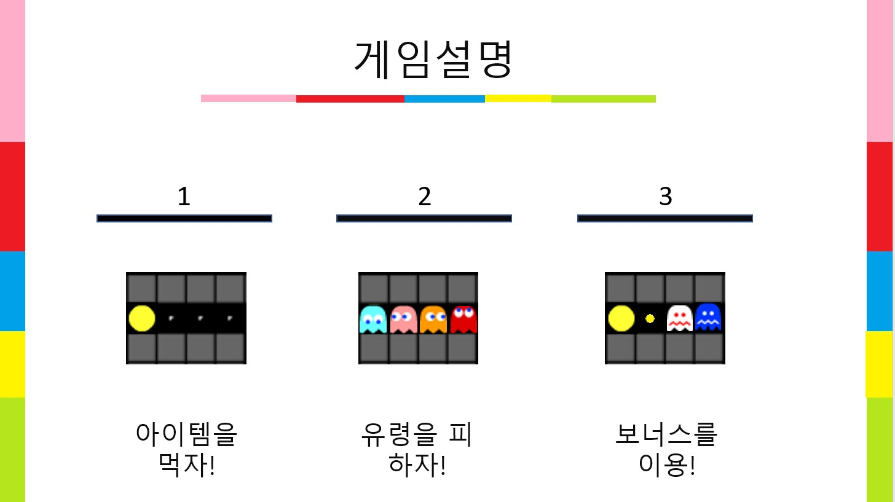
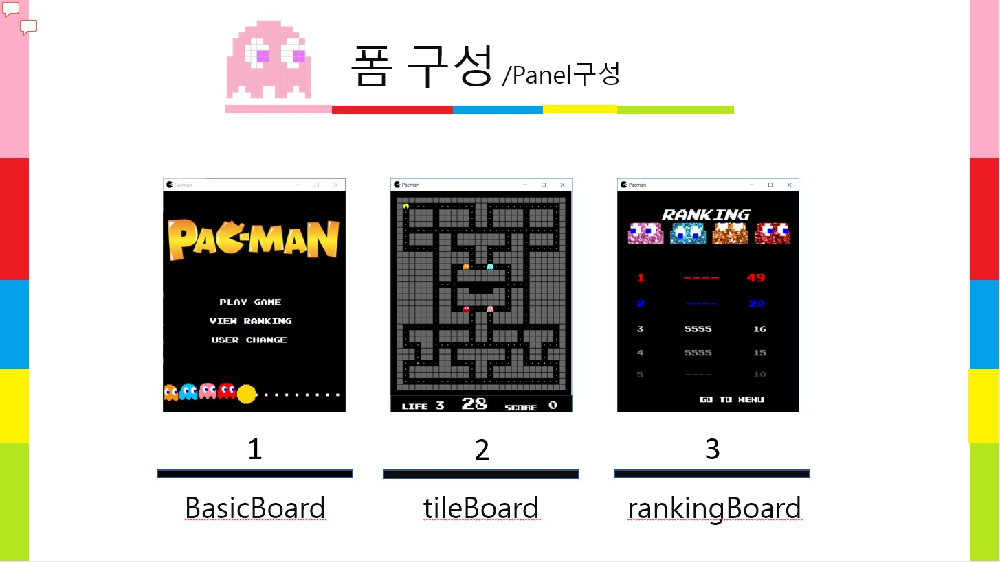
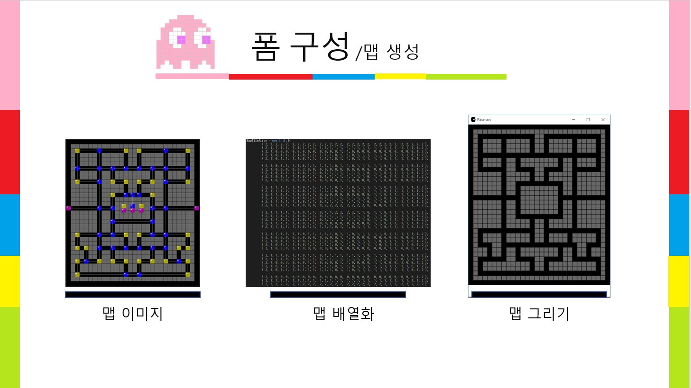
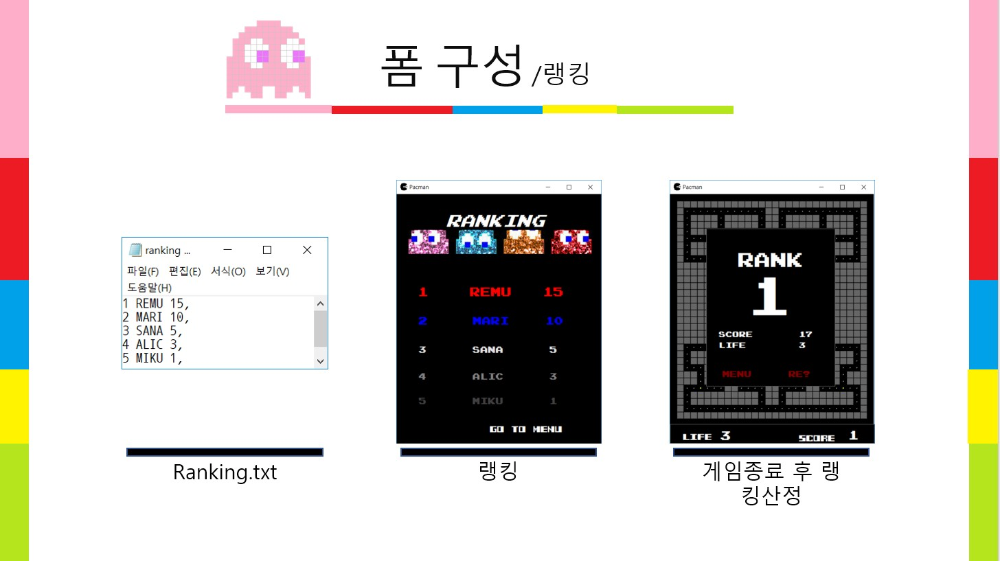
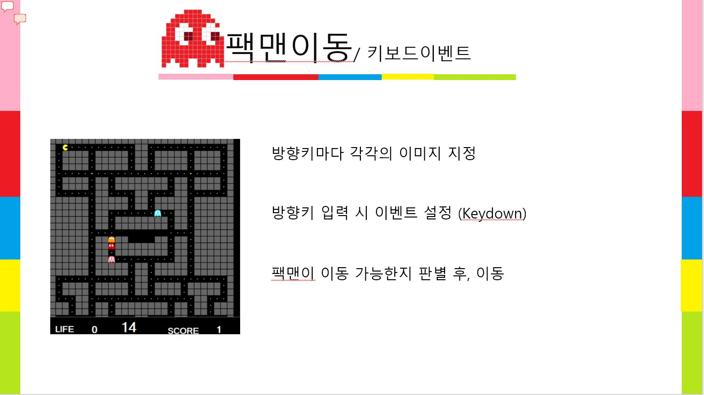
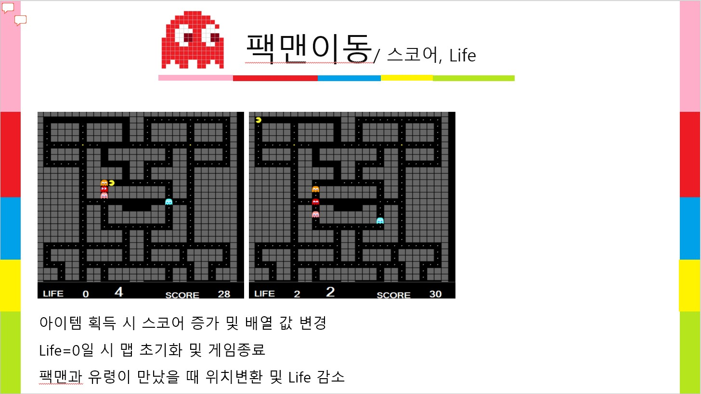
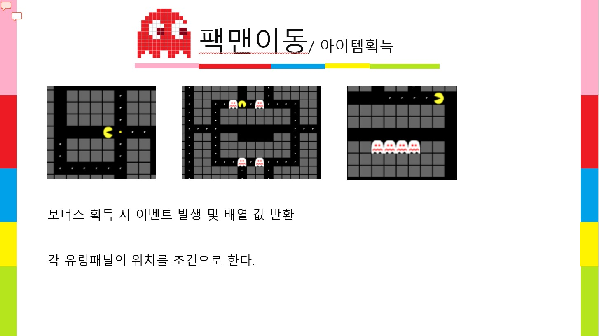
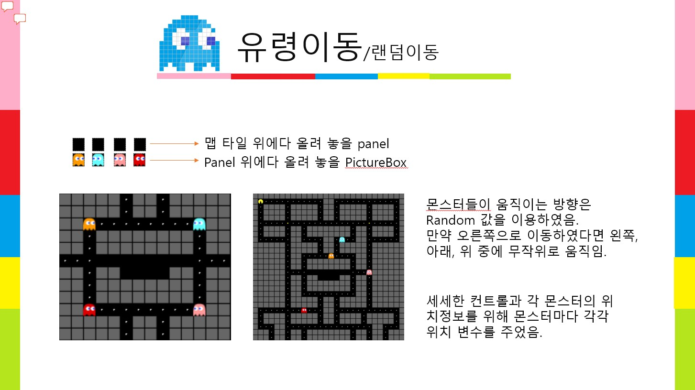
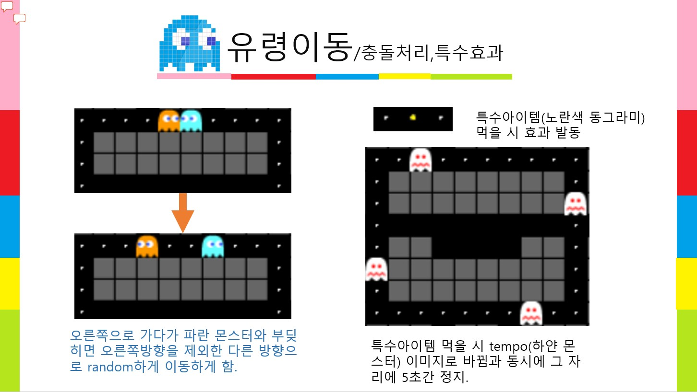
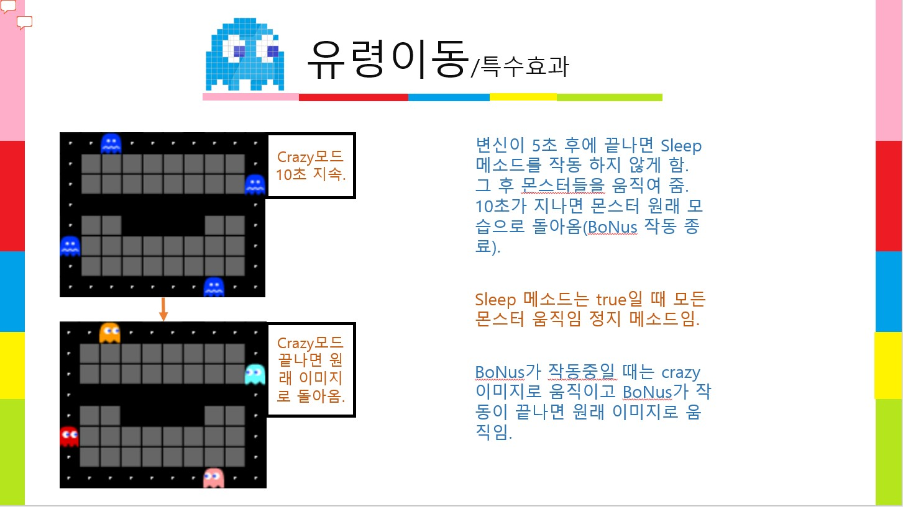

C# PacMan
===

C# 팩맨 게임

> Readme 작성중...

 

게임 
---

| 게임설명 |
|:----------------------------------------:|
||

| Panel 구성 |
|:----------------------------------------:|
||

| 맵생성 |
|:----------------------------------------:|
||

| 랭킹 |
|:----------------------------------------:|
||

| 키보드 이벤트 |
|:----------------------------------------:|
||

| 스코어, Life 처리 |
|:----------------------------------------:|
||

| 아이템 획득 |
|:----------------------------------------:|
||

| 랜덤이동 |
|:----------------------------------------:|
||

| 충돌처리, 특수효과 |
|:----------------------------------------:|
||

| 특수효과2 |
|:----------------------------------------:|
||
